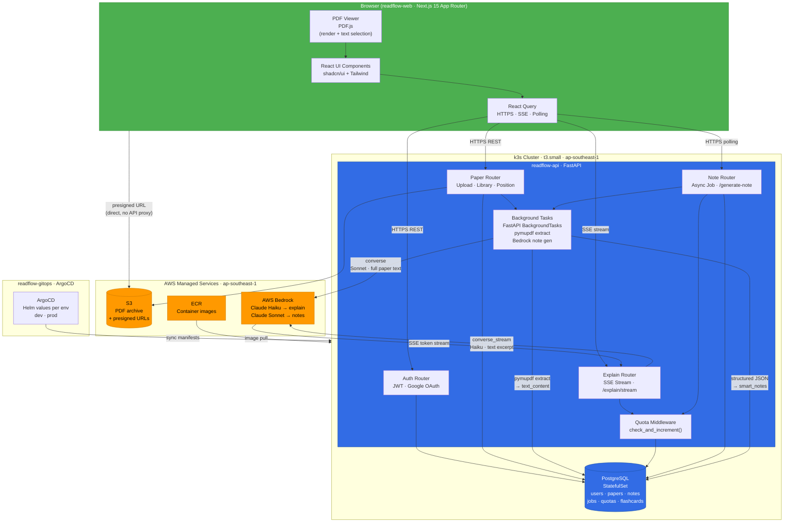
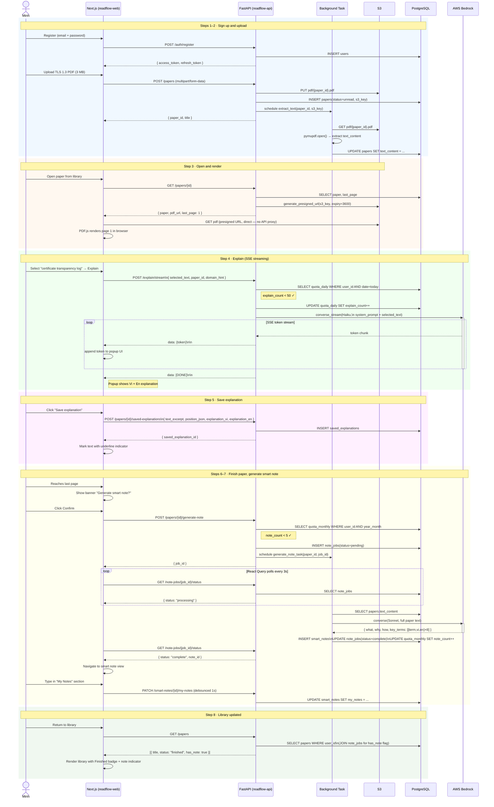

# Architecture Decision Document — ReadFlow

_This document builds collaboratively through step-by-step discovery. Sections are appended as we work through each architectural decision together._

---

## Project Context Analysis

### Requirements Overview

**Functional Requirements (35 total across 6 groups):**
- AUTH (FR-001–FR-006): JWT session management, Google OAuth, user isolation, pre-launch account deletion gate
- READER (FR-010–FR-014): PDF upload (50 MB max), client-side render via PDF.js, server-side position persistence
- EXPLAIN (FR-020–FR-026): Text selection → bilingual popup, ephemeral by default, explicit save option, Claude Haiku via Bedrock, < 4s p95
- NOTE (FR-030–FR-037): Async generation triggered by user confirm, fixed 3-field Key Terms schema, read-only AI + editable My Notes, Claude Sonnet via Bedrock, < 30s p95
- LIBRARY (FR-040–FR-044): CRUD with status filter, paper deletion cascades to notes + saved explanations
- QUOTA (FR-050a–FR-054): Server-side enforcement, dual quotas (50 explain/day, 5 notes/month), admin override

**Non-Functional Requirements driving architecture:**
- NFR-D01: ALL data in operator AWS account — every component choice must pass this gate
- NFR-D02/D03: Explain transmits text excerpt only; smart note transmits full paper — different Bedrock call shapes
- NFR-PERF: Explain < 4s p95 (hot path), smart note < 30s p95 (async acceptable), library < 1s
- NFR-C01: $15–25/month total — eliminates managed services with significant base cost
- Region: ap-southeast-1 (data residency priority)

**Scale & Complexity:**
- Primary domain: Full-stack web + AI integration + async job processing
- Complexity level: Medium-High for a solo build
- User isolation: Row-level per user_id — no team/org hierarchy in v1
- Estimated architectural components: 9–11

### Technical Constraints & Dependencies

- Runtime: k3s on single t3.medium (~2 vCPU, 4 GB RAM) — all services must coexist
- No managed job queue with significant base cost (rules out SQS + Celery/Redis unless Redis is shared)
- PDF.js is client-side — server cannot depend on browser-extracted text for AI features
- AWS Bedrock is the only allowed external AI endpoint — no direct Anthropic API
- PostgreSQL on RDS (not Aurora) — cost constraint; single AZ acceptable for v1
- CI/CD: GitHub Actions → ECR → ArgoCD (locked)

### Cross-Cutting Concerns Identified

1. **Auth context propagation** — JWT must be verified on every API route; quota service must receive user_id per request
2. **Quota enforcement intercept** — Both explain and smart note flows must check quota before calling Bedrock
3. **Data residency gate** — Every third-party integration must be AWS-native or self-hosted in ap-southeast-1
4. **Cost containment** — All background processing must share the t3.medium; no always-on services with idle cost
5. **Consistent error UX** — PDF incompatibility, Bedrock failures, quota exhaustion all need a unified error response contract
6. **Text extraction duality** — Client-side (PDF.js selection for explain) and server-side (full paper for smart note) must both work on the same PDF

---

## Starter Template Evaluation

### Primary Technology Domain
Polyrepo full-stack: Next.js (React) frontend + FastAPI (Python) backend. Two starter configurations — one per service repo.

### Repo 1: readflow-web (Next.js Frontend)

**Initialization Command:**
```bash
npx create-next-app@latest readflow-web \
  --typescript \
  --tailwind \
  --eslint \
  --app \
  --src-dir \
  --import-alias "@/*"
```

**Architectural Decisions Provided:**
- Language: TypeScript (add `"strict": true` to tsconfig)
- Routing: App Router (Next.js 15 — server components, layouts, streaming support)
- Styling: Tailwind CSS v3
- Linting: ESLint with Next.js config
- Structure: `src/app/`, `src/components/`, `src/lib/`, `src/types/`

**Additional tooling (post-init):**
- `shadcn/ui` — headless Radix UI + Tailwind components; no external services, data-residency safe
- `pdfjs-dist` — PDF.js for in-browser PDF rendering and text layer
- `@tanstack/react-query` — server state, async smart note polling, SSE explain stream

### Repo 2: readflow-api (FastAPI Backend)

**Manual scaffold — no official CLI generator:**
```
readflow-api/
├── app/
│   ├── main.py
│   ├── config.py              # pydantic-settings
│   ├── routers/               # auth, papers, explain, notes, library, quota
│   ├── models/                # SQLAlchemy ORM models
│   ├── schemas/               # Pydantic request/response schemas
│   ├── services/              # ai_service, pdf_service, quota_service
│   └── dependencies.py        # get_db, get_current_user
├── alembic/
├── tests/
├── Dockerfile
└── pyproject.toml
```

**Core dependencies:**
```
fastapi>=0.115, uvicorn[standard]
sqlalchemy>=2.0, alembic
pydantic-settings
python-jose[cryptography], passlib[bcrypt]
boto3                    # Bedrock + S3
pymupdf (fitz)           # Server-side PDF text extraction (replaces pdfplumber)
python-multipart         # File upload
pytest, httpx            # Testing
```

**PyMuPDF substitution note:** `pdfplumber` replaced by `pymupdf` (fitz) for server-side extraction — significantly faster for large PDFs, lower memory footprint, better text-layer accuracy on academic papers with dense formatting.

**Note:** Repo initialization is Story 1 for each service.

---

## Core Architectural Decisions

### Decision Priority Analysis

**Critical (block implementation):**
- ADR-001: Text extraction strategy — affects PDF upload pipeline, Bedrock call shape
- ADR-002: Bedrock explain streaming — affects API endpoint design, frontend SSE handling
- ADR-003: Smart note async strategy — affects job model, DB schema, polling contract
- ADR-004: SM-2 scheduler location — affects v1.5 DB schema, must be accommodated in v1 data model

**Already decided by stack/PRD (not re-decided here):**
- AWS Bedrock (Haiku for explain, Sonnet for notes) — PRD FR-026, FR-036
- PostgreSQL + S3 + k3s + ArgoCD — Addendum
- JWT auth + Google OAuth — PRD FR-001–FR-003
- Quota enforcement server-side — PRD FR-053

**Deferred (post-MVP):**
- CDN strategy (CloudFront) — no user-uploaded assets need CDN in v1
- Observability stack (OpenTelemetry + Grafana) — manual CloudWatch logs sufficient for dogfooding
- Read replica for PostgreSQL — single instance acceptable for v1 load

---

### ADR-001 — PDF Text Extraction Strategy

**Decision:** PyMuPDF (`fitz`) server-side extraction as the single source of truth for all AI features.

**Rationale:**
PDF.js runs in the browser and extracts text for interactive use (user text selection for explain). However, it cannot provide the full structured paper text to the server for smart note generation. Two separate extraction paths would create text inconsistency. PyMuPDF on the server is the authoritative extraction — faster than pdfplumber, handles multi-column layouts better, and produces clean Unicode output for Bedrock prompts. Text is extracted once on upload, stored in `papers.text_content` (PostgreSQL), and reused for all subsequent AI calls without re-parsing the PDF.

**Rejected alternative:** pdfplumber — equivalent capability but 3–5× slower on large PDFs; PyMuPDF is the preferred choice for performance-sensitive extraction pipelines.

**Rejected alternative:** Client-side only (PDF.js) — browser cannot reliably serialize full paper text structure for server consumption; selection coordinates are not the same as full-document text order.

**Consequence on component diagram:**
- PDF upload pipeline: `POST /papers` → store to S3 → `BackgroundTask: pymupdf_extract(s3_key)` → `UPDATE papers SET text_content = ...`
- Explain endpoint receives `selected_text` from client (browser selection) — does NOT re-extract from S3
- Smart note endpoint reads `papers.text_content` from PostgreSQL — does NOT re-download from S3
- S3 is archive-only after extraction; never read again in the hot path

---

### ADR-002 — Bedrock Explain Call: Streaming via SSE

**Decision:** Server-Sent Events (SSE) streaming for explain responses.

**Rationale:**
Next.js 15 App Router supports streaming responses natively via `ReadableStream`. React Query can consume SSE streams. Claude Haiku via Bedrock's `converse_stream` API streams tokens with minimal overhead. The UX benefit is material: a Vietnamese explanation appearing progressively gives the user immediate feedback and feels responsive even if total latency is 2–3s. Batch response holds the connection open and then dumps all text at once — perceived latency is the same as the full response time with none of the progressive feel. The p95 < 4s target is achievable with Haiku streaming; the first tokens appear in < 500ms.

**Rejected alternative:** Batch (single HTTP response after full generation) — same server-side latency, worse perceived performance, no UX benefit, no technical simplification.

**Consequence on component diagram:**
- `POST /explain/stream` returns `Content-Type: text/event-stream`
- FastAPI uses `StreamingResponse` with an async generator consuming `bedrock.converse_stream()`
- Frontend: React Query with a custom hook using `EventSource` or `fetch` with `ReadableStream` reader
- No job table needed for explain — stateless streaming call
- Quota check happens before stream opens; if over quota, return 429 before streaming begins

---

### ADR-003 — Smart Note Generation: Async with React Query Polling

**Decision:** Async generation with React Query polling every 3 seconds.

**Rationale:**
30s p95 latency violates standard HTTP timeout assumptions (Nginx default: 60s, but mobile networks are unreliable at 30s). Holding an HTTP connection for 30s is fragile. PRD FR-032 already mandates async with a progress indicator. FastAPI `BackgroundTasks` runs the Bedrock call in the same process without requiring a separate queue service (no Redis, no Celery, no SQS — all of which add cost and complexity to the t3.medium). React Query's `refetchInterval` makes polling trivial: POST to create job → poll status → navigate on completion. The polling contract is simple and debuggable.

**Rejected alternative:** Synchronous HTTP — 30s connection hold is unreliable; violates timeout assumptions on mobile networks.

**Rejected alternative:** WebSocket — bidirectional communication is overkill for a one-direction progress notification. Adds persistent connection overhead to the server.

**Rejected alternative:** SSE for progress — would work, but requires the frontend to hold an SSE connection open for up to 30s. Polling is simpler, more resilient to network interruption, and easier to test.

**Consequence on component diagram:**
- `POST /papers/{id}/generate-note` → inserts `note_jobs(status=pending)` → schedules `BackgroundTask: generate_note_task(paper_id, job_id)` → returns `{ job_id }`
- `GET /note-jobs/{job_id}/status` → returns `{ status: pending|processing|complete|failed, note_id? }`
- `generate_note_task`: reads `papers.text_content` → calls Bedrock Sonnet → parses structured JSON → inserts `smart_notes` → updates `note_jobs(status=complete, note_id)`
- New DB tables required: `note_jobs(id, paper_id, user_id, status, note_id, created_at, updated_at)`
- Frontend polls `/note-jobs/{id}/status` every 3s using `refetchInterval`; stops when status is `complete` or `failed`

---

### ADR-004 — SM-2 Scheduler: Server-Side

**Decision:** SM-2 interval calculation and review scheduling runs server-side.

**Rationale:**
Client-side SM-2 (localStorage/IndexedDB) is architecturally fragile: browser data clears erase all spaced repetition progress; quota enforcement (future paid tier) requires server knowledge of review events; cross-device sync (v1.5 roadmap item) is impossible without server state. FR-014 already established server-side persistence as the pattern for reading position — SM-2 must follow the same model for consistency. Server-side also makes the review history auditable and correctable. The SM-2 calculation itself is a simple algorithm (a few lines of arithmetic per review); it adds negligible server load.

**Rejected alternative:** Client-side (localStorage/IndexedDB) — browser state is not durable; incompatible with cross-device sync; cannot enforce server-side quota or premium tier restrictions.

**Consequence on component diagram (v1.5 accommodation):**
- DB schema must include in v1: `flashcards(id, paper_id, user_id, term_en, definition_vi, context_en, interval_days, ease_factor, due_date, repetitions, created_at)`
- No flashcard endpoints needed in v1 — but schema is present so v1.5 doesn't require a breaking migration
- `POST /review/cards/{id}/rate` (v1.5): receives `rating` (again/hard/good/easy) → calculates next interval using SM-2 → updates `flashcards` row
- `GET /review/queue` (v1.5): returns cards where `due_date <= today` for the authenticated user

---

### Data Architecture Decisions

**Schema design (v1 tables):**
```
users(id, email, password_hash, google_id, created_at)
papers(id, user_id, title, s3_key, text_content, status, last_page, created_at)
saved_explanations(id, paper_id, user_id, text_excerpt, text_position_json,
                   explanation_vi, explanation_en, domain_tag, created_at)
smart_notes(id, paper_id, user_id, what, why, how, key_terms_json, my_notes, created_at, updated_at)
note_jobs(id, paper_id, user_id, status, note_id, error_msg, created_at, updated_at)
quota_daily(id, user_id, date, explain_count)
quota_monthly(id, user_id, year_month, note_count)
flashcards(id, paper_id, user_id, term_en, definition_vi, context_en,
           interval_days, ease_factor, due_date, repetitions, created_at)  -- v1.5 ready
```

**Key design notes:**
- `key_terms_json`: JSONB array of `{term, definition_vi, context_en}` objects — three addressable fields per FR-033
- `text_position_json`: stores page + character offset for saved explanation anchor
- `quota_daily` and `quota_monthly` are separate tables — different reset cadences
- All tables include `user_id` for row-level isolation (FR-004)

**Migrations:** Alembic with auto-generated revisions; migration runs on container startup in dev, manual trigger in prod.

---

### Authentication & Security Decisions

- **JWT tokens:** Access token (15 min expiry, stored in memory), refresh token (7 days, httpOnly cookie)
- **Google OAuth:** Server-side callback at `/auth/google/callback` — exchanges code for profile, issues our own JWT. No Clerk/Auth0 (would violate NFR-D01)
- **Password hashing:** bcrypt via passlib
- **API security:** All routes except `/auth/*` require `Authorization: Bearer {token}` header. FastAPI `Depends(get_current_user)` enforces this uniformly
- **CORS:** Restricted to `readflow-web` domain only
- **S3 access:** Pre-signed URLs with 1-hour expiry — frontend fetches PDF directly from S3 without proxying through API (reduces API bandwidth cost and load)

---

### API & Communication Patterns

- **Style:** REST with conventional paths (`/papers`, `/papers/{id}/explain`, `/papers/{id}/generate-note`)
- **Explain:** `POST /explain/stream` → `StreamingResponse(text/event-stream)` — stateless
- **Smart note:** `POST /papers/{id}/generate-note` → `{ job_id }` → `GET /note-jobs/{id}/status` → polling
- **Error schema (uniform):** `{ "error_code": "QUOTA_EXCEEDED", "message": "...", "detail": { ... } }`
- **OpenAPI docs:** Auto-generated at `/docs` (FastAPI default) — disabled in prod, enabled in dev
- **Quota intercept:** `QuotaService.check_and_increment(user_id, quota_type)` called at the start of explain and generate-note routes — raises `HTTP 429` with reset time if exhausted

---

### Infrastructure & Cost Notes

**Target configuration:**
| Resource | Type | Est. Monthly Cost |
|---|---|---|
| EC2 (k3s node) | t3.small (2 vCPU, 2 GB) | ~$15 |
| PostgreSQL | In-cluster pod (no RDS in v1) | $0 |
| S3 | Standard storage + transfer | ~$1–2 |
| AWS Bedrock | Per-call (quota-capped) | ~$2–5 |
| ECR | Container image storage | ~$1 |
| **Total** | | **~$19–23/month** |

**Note:** RDS skipped in v1 to meet the $10–20/month budget target. PostgreSQL runs as a k3s StatefulSet with a PersistentVolumeClaim on the t3.small's EBS volume. Acceptable for solo dogfooding; migrate to RDS t3.micro when public launch approaches.

**t3.small RAM note:** 2 GB RAM is tight for Next.js SSR + FastAPI + PostgreSQL + k3s overhead. If memory pressure causes OOM kills, upgrade to t3.medium (~$30/month) and accept the budget overrun. Profile before deciding.

**PVC/EBS guardrail:** PostgreSQL runs on a k3s StatefulSet with a PersistentVolumeClaim backed by an EBS `gp3` volume. Critical operational rules:
- The EBS volume is the only durable state for the database. **Never delete the PVC or the PV without a verified backup.**
- Enable automated EBS snapshots (AWS Data Lifecycle Manager) before any public launch — daily snapshots with 7-day retention, cost ~$0.05/GB/month.
- The `readflow-gitops` repo must not contain any manifest that deletes or replaces the `postgres` StatefulSet PVC. ArgoCD pruning for this resource should be disabled (`argocd.argoproj.io/sync-options: Prune=false` annotation on the PVC).
- During k3s upgrades or node replacement, drain the node only after confirming the EBS volume detach/reattach sequence completes without errors.

**Implementation sequence (dependency order):**
1. Infra bootstrap (readflow-infra): VPC, EC2, S3, ECR, IAM, k3s install
2. CI/CD (readflow-gitops): ArgoCD install, Helm chart skeletons
3. Auth foundation (readflow-api): users table, JWT, Google OAuth
4. PDF upload + library (readflow-api + readflow-web): S3 upload, PyMuPDF extraction, paper CRUD
5. Explain streaming (readflow-api + readflow-web): SSE endpoint, PDF.js text selection, popup UI
6. Smart note async (readflow-api + readflow-web): job table, BackgroundTask, polling UI
7. Quota enforcement (readflow-api): quota tables, middleware intercept
8. Saved explanations (readflow-api + readflow-web): save endpoint, position anchoring in reader

---

## Implementation Patterns

Full patterns documented in [`patterns.md`](./patterns.md). Summary of four critical areas:

| Pattern | Rule | Enforcement |
|---|---|---|
| **API Contract** | All JSON responses in `{ data, meta }` envelope; errors use defined `ErrorCode` enum; SSE explain stream uses typed event format | Code review + TypeScript types catch mismatches at compile time |
| **DB Migrations** | Alembic `verb_noun_context` naming; never edit existing migrations; additive-only in v1 | CI: `git diff` check + `alembic check` on every PR |
| **Bedrock Abstraction** | Only `ai_service.py` calls boto3; all Bedrock calls isolated there | CI: `grep -r "boto3" app/ --include="*.py" --exclude="ai_service.py"` fails on violation |
| **Env Parity** | Same env var names in `.env.local`, `docker-compose.yml`, and k3s Secrets; `.env.example` documents all required vars | PR checklist; new vars must appear in all three places |

---

## System Component Diagram



**Key data residency boundary:** Everything inside `k3s Cluster` and `AWS Managed Services` is within the operator's AWS account in `ap-southeast-1`. The browser never talks directly to Bedrock — all AI calls are proxied through the API, ensuring the operator controls what text leaves the client.

---

## UJ-1 Data Flow — Minh's First Reading Session



---

## Project Structure Scaffold

### Repository Overview (Polyrepo — GitHub)

| Repo | Stack | Primary Responsibility |
|---|---|---|
| `readflow-web` | Next.js 15, TypeScript, Tailwind | Frontend UI, PDF.js viewer, React Query |
| `readflow-api` | FastAPI, Python, SQLAlchemy | REST API, AI orchestration, quota management |
| `readflow-infra` | Terraform, HCL | VPC, EC2/k3s, S3, ECR, IAM, EBS snapshots |
| `readflow-gitops` | ArgoCD, Helm | GitOps sync manifests, Helm values per env |
| `readflow-docs` | Markdown | BMAD artifacts, ADRs, runbooks |

---

### readflow-web

```
readflow-web/
├── src/
│   ├── app/                         # Next.js 15 App Router
│   │   ├── (auth)/
│   │   │   ├── login/page.tsx
│   │   │   └── register/page.tsx
│   │   ├── (app)/
│   │   │   ├── library/page.tsx
│   │   │   ├── reader/[paperId]/page.tsx
│   │   │   └── notes/[paperId]/page.tsx
│   │   ├── layout.tsx
│   │   └── globals.css
│   ├── components/
│   │   ├── reader/
│   │   │   ├── PDFViewer.tsx        # PDF.js integration
│   │   │   ├── ExplainPopup.tsx     # SSE streaming display
│   │   │   └── SmartNoteBanner.tsx  # last-page trigger
│   │   ├── library/
│   │   │   ├── PaperCard.tsx
│   │   │   └── UploadDialog.tsx
│   │   └── ui/                      # shadcn/ui re-exports
│   ├── lib/
│   │   ├── api.ts                   # typed fetch wrapper
│   │   ├── sse.ts                   # SSE stream hook
│   │   └── query-client.ts
│   └── types/
│       └── api.ts                   # mirrors backend Pydantic schemas
├── public/
├── .env.example
├── .env.local                       # git-ignored
├── next.config.ts
├── tailwind.config.ts
└── tsconfig.json
```

---

### readflow-api

```
readflow-api/
├── app/
│   ├── main.py                      # FastAPI app init, CORS, lifespan
│   ├── config.py                    # pydantic-settings, env var validation
│   ├── dependencies.py              # get_db(), get_current_user()
│   ├── routers/
│   │   ├── auth.py                  # /auth/register, /login, /google/callback, /refresh
│   │   ├── papers.py                # /papers CRUD, /papers/{id}/upload, position
│   │   ├── explain.py               # /explain/stream (SSE)
│   │   ├── notes.py                 # /papers/{id}/generate-note, /note-jobs/{id}/status
│   │   ├── library.py               # /papers list + filter
│   │   └── quota.py                 # /quota/status (admin)
│   ├── models/                      # SQLAlchemy ORM
│   │   ├── user.py
│   │   ├── paper.py
│   │   ├── smart_note.py
│   │   ├── note_job.py
│   │   ├── saved_explanation.py
│   │   ├── quota.py
│   │   └── flashcard.py             # v1.5 schema, no endpoints in v1
│   ├── schemas/                     # Pydantic request/response
│   │   ├── auth.py
│   │   ├── paper.py
│   │   ├── explain.py
│   │   └── note.py
│   ├── services/
│   │   ├── ai_service.py            # SOLE boto3 caller for Bedrock
│   │   ├── pdf_service.py           # pymupdf extraction
│   │   ├── quota_service.py         # check_and_increment()
│   │   └── prompts/                 # .txt prompt templates (not inline strings)
│   │       ├── explain_system.txt
│   │       └── note_system.txt
│   └── tasks/
│       ├── extract_text.py          # BackgroundTask: pymupdf on upload
│       └── generate_note.py         # BackgroundTask: Bedrock Sonnet
├── alembic/
│   ├── versions/                    # migrations — never edit existing files
│   └── env.py
├── tests/
│   ├── conftest.py                  # test DB + Bedrock mock fixture
│   ├── test_auth.py
│   ├── test_explain.py
│   └── test_notes.py
├── Dockerfile
├── docker-compose.yml               # mirrors k3s env for local dev
├── .env.example
├── .env.local                       # git-ignored
└── pyproject.toml
```

---

### readflow-infra

```
readflow-infra/
├── bootstrap/                       # ONE-TIME manual apply only — not in CI
│   ├── main.tf                      # S3 backend bucket + DynamoDB lock table
│   └── README.md                    # "Run once: terraform init && terraform apply"
├── modules/
│   ├── vpc/                         # VPC, subnets, security groups
│   ├── compute/                     # EC2 t3.small, k3s install script, EBS volume
│   ├── storage/                     # S3 buckets (papers + terraform state)
│   ├── ecr/                         # ECR repo, lifecycle policy
│   └── iam/                         # EC2 instance profile: Bedrock + S3 + ECR policies
├── envs/
│   ├── dev/
│   │   ├── main.tf
│   │   └── terraform.tfvars
│   └── prod/
│       ├── main.tf
│       └── terraform.tfvars
├── .terraform.lock.hcl
└── README.md
```

> **bootstrap/ note:** The `bootstrap/` directory initializes the Terraform remote state backend (S3 bucket + DynamoDB lock table). It is a one-time manual apply before any other Terraform runs. It must **not** be included in CI/CD pipelines — doing so would cause circular dependency (CI needs state backend to run; state backend is created by CI). After applying, commit the `.terraform.lock.hcl` and configure `backend "s3"` in `envs/`.

---

### readflow-gitops

```
readflow-gitops/
├── apps/
│   ├── readflow-api/
│   │   ├── Chart.yaml
│   │   ├── values.yaml              # base values
│   │   ├── values-dev.yaml
│   │   └── values-prod.yaml
│   └── readflow-web/
│       ├── Chart.yaml
│       ├── values.yaml
│       ├── values-dev.yaml
│       └── values-prod.yaml
├── infra/
│   └── postgres/
│       ├── statefulset.yaml
│       └── pvc.yaml                 # annotation: argocd.argoproj.io/sync-options: Prune=false
├── argocd/
│   ├── app-readflow-api.yaml        # ArgoCD Application CRD
│   └── app-readflow-web.yaml
└── README.md
```

---

### readflow-docs

```
readflow-docs/
├── adr/
│   ├── ADR-001-pdf-extraction.md
│   ├── ADR-002-bedrock-streaming.md
│   ├── ADR-003-smart-note-async.md
│   └── ADR-004-sm2-server-side.md
├── runbooks/
│   ├── k3s-node-replacement.md      # includes StatefulSet finalizer handling (see note below)
│   ├── postgres-backup-restore.md
│   └── bedrock-quota-override.md
├── bmad-artifacts/                  # PRD, architecture, patterns from this session
└── README.md
```

> **k3s-node-replacement runbook note:** The runbook must include a StatefulSet finalizer handling section. When replacing the k3s node, PostgreSQL StatefulSet pods may retain a `kubernetes.io/pvc-protection` finalizer that blocks PVC deletion. The sequence is: (1) cordon + drain the node; (2) confirm EBS volume detach completes before terminating EC2 instance; (3) if StatefulSet pod is stuck in `Terminating`, patch the finalizer: `kubectl patch pod postgres-0 -p '{"metadata":{"finalizers":[]}}' --type=merge`; (4) reattach EBS volume to new node before starting k3s on it; (5) verify PVC is `Bound` before re-enabling ArgoCD sync.
